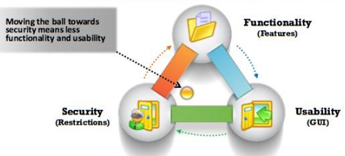

# MODULE 1 * Introduction to Ethical Hacking

## INFORMATION SECURITY OVERVIEW

### Terminology

**Hack Value**: Is the notion among hackers to evaluate something that is worth doing or is insterenting. 

**Vulnerability**: Is the existence of weakness, desing, or an implementing error that, when exploited, leads to an unexpected and undesirable event compromising the security of the system.

**Exploit**: Is a breach of IT system security through vulnerabilities, in the context of an attack on a system or network. It also refers to mailicious softw. or commands that can cause unanticipated behavior of legitimate softw. or hardw. through attackers taking advantage of the vulnerabilities.

**Payload**: Is the part of a malware or an exploit code that performs the intended mailicious actions, which can include creating backdoor access to a viticm's machine, damaging or deleting files, commiting data theft and hijacking computer. 

**Zero*Day Attack**: The attacker exploits vulnerabilities in a computer application before the softw. developer can release a patch for then.

**Daisy Chaining**: It invloves gaining access to one network and/or computer and then using the same information to gain access to multiple networks and computers that contain desirable information.

**Doxing**: Refers to gathering and publishing personally idntifiable information such as an individual's name and email address, or other sensitive information pertaining to an entire organization.

**Bot**: Softw. application or program that can be controlled remotely to execute or automate predefined tasks.

### Elements of Information Security

**Information Security** is defined as *"a state of well*being of inforation and infrastructure in which the possibility of theft, tampering, and disruption of information and services is kept low or tolerable"*. It relies on five major elements: confidentiality, integrity, availability, authenticity, and non*repudiation.

* **Confidentiality** Is the assurance that the information is accesible only to those who are authorized to have access. Confidentiality breaches may occur due to improper data handling or a hacking attempt. Confidentiality controls include data classification, data encryption, and proper equipment disposal.
* **Integrity** Is the trustworthiness of data or resources in the prevention of improper and unauthorized changes * the assurance that information is sufficiently accurate for its purpose. Measures to maintian data integrity may include a checksum and access control.
* **Availability** Is the assurance that the systems responsible for delivering, storing, and processing information are accesible when reaquired by authorized users. Measures to maintain data availability can include redundant systems disk arrays and clustered machines, antivirus softw. to stop malware from destroying networks, and DDoS prevention systems.
* **Authenticity** Refers to the characteristic of a communication, document, or any data that ensures the quality of being genuine or uncorrupted. The major role of authentication is to confirm that a user is genuine, one who he/she claims to be. Controls such as biometrics, smart cards, and digital certificates ensure the authenticity of data, transactions, communications, or documents.
* **Non*Repudation** Is a way to guarantee that the sender of a message cannot later deny having sent the message, and that the recipient cannot deny having received the message. Individuals and organization use digital signatures to ensure non*repudation.

### The Security, Functionality, and Usability Triangle

Level of security in any system can be defined by the strength of three components:

* **Functionality**: The set of features providen by the system.
* **Usability**: The GUI components used to design the system for ease of use.
* **Security**: Restrictions imposed on accessing the components of the system.

The relationship between these three components is demonstrated by using a triangle because increase or decrease in any one of the component automatically affects the other two components.

For example, increased security and decreased Functionality and Usability.

## INFORMATION SECURITY THREATS AND ATTACK VECTORS

**Attacks=Motive(Goal)+Method+Vulnerability**

**Motives**

* Disrupting business continuity
* Performing information theft
* Manipulating data
* Creating fear and chaos
* Financial loss to the target
* Religious or political beliefs
* Military objectives
* Damaging reputation of the target
* Revenge
* Ransom

### Top information Security Attack Vectors

* Cloud computing Threats
* Advanced Persistent Threats. Focuses on stealing information from the victim machine without its user being aware of it.
* Viruses and Worms.
   * Virus: self*replicating program that produces a copy of itself by attacing to another program, computer boot sector or document
   * Worm: malicious program that replicates, executes and spreads across network connections.
* Ransonware
* Mobile Threats
* Botnet
* Insider Attack
* Phising
* Web Application Threats
* IoT Threats

### Information Security Threat Categories

**Network Threats**

* Information gathering.
* Sniffing and eavesdropping
* Spoofing
* Session hijacking
* MITM attack
* DNS and ARP poisoning
* Passw*based attacks
* DOS attacks
* Compromised*key attack
* FW and IDS attack

**Host Threats**

* Malware attacks
* Foot printing
* DOS attacks
* Arbitrary code execution
* Unauthorized access
* Profiling
* Passw attacks
* Privilege escalation
* Backdoor attacks
* Physical security threats

**Application Threats**

* Improper data/input validation
* Authentication and authorization
* Security misconfiguration
* Improper error handling and exception mgmt.
* Information disclosure
* Hidden*field manipulation
* Broken session mgmt.
* Buffer overflow issues
* Crypto attacks
* SQL injection
* Phising

### Types of Attacks on a System

#### OS Attacks

*OS Vulnerabilities*

* Buffer overflow
* Bugs
* Unpatches OS

*OS level attacks*

* Specific network protocol implementations
* Built*in authentication systems
* File*system security
* Passwords and encryption mechanisms

#### Misconfiguration Attacks
#### Application Level Attacks

* Buffer overflow attacks
* Sensitive information disclosure
* Cross*site scripting
* Session hijacking
* MITM attacks
* DOS attacks
* SQL Injection attacks
* Phising
* Parameter/form tampering
* Directory traversal attacks

### Information Warfare

Use of ICT for competitive advantages over an opponent. 

Martin Libicki has divided it into these categories:

* Command and control warfare (C2 warfare): Impact an atacker possesses over a compromised system or network that they control.
* Intelligence*based warfare: Is a sensor*based tech. that directly corrupts technological systems.
* Electronic warfare: Uses radio electronic and cryptographic techniques to degrade communication.
* Psychological warfare: Use various techniques such as propaganda and terror to demoralize one's adversary.
* Hacker warfare: Can vary from shutdown of systems, data errors, theft of information, theft of services, system monitoring, fasle messaging, and access to data.
* Economic warfare: Can affect the economy of a business or nation by blocking the flow of information.
* Cyber warfare: Use of information systems against the virtual personas of individuals or groups. It is the broadest of all information warfare and includes information terrorism, semantic attacks (similar to Hacker warfare, but instead of harming a system, it takes the system over and the system will be perceived as operating correctly), and simula*warfare (simulated war, for example, acquiring weapons for mere demonstration rather than actual use).

Each form of the information warfare, consists of both defensive and offensive strategies.

* Defensive Information Warfare: Involves all strategies and actions to defend against attacks on ICT assets.
* Offensive Information Warfare: Involves attacks against ICT assets of an opponent.

## HACKING CONCEPTS

**Definition**: Hacking in the field of computer security refers to exploit system vulnerabilities and compromising security controls to gain unauthorized or inappropiate access to system resources.

### Hacker Classes

* Black Hats
* White Hats
* Gray Hats
* Suicide Hackers
* Script Kiddies
* Cyber Terrorists
* State Sponsored Hackers
* Hacktivist

### Hacker Phases

* Reconnaissance
* Scanning
* Gaining Access
* Maintaining Access
* Clearing Tracks

### Reconnaissance

Preparatory phase where an attacker seeks to gather information about a target.

Target range may include the target organization's clients, employees, operations, network and systems.

**Pasive Reconnaissance**: Involves acquiring information without directly interacting with the target.

**Active Reconnaissance**: Interacting with the target directly by any means.

### Scanning

### Gaining Access

### Maintaining Access

### Clearing Tracks

## ETHICAL HACKING CONCEPTS

**Definition**: Ethical hacking is the practice of employing computer and network skills in order to assist organizations in testing their network security for possible loopholes and vulnerabilities. With the permission of the network/system owner and without the intention to cause harm.

* Hacker: Refers to a person who enjoys learning the details of computer systems and stretching his or her capabilities
* To hack: Rapid development of new programs or the reverse engineering of existing softw. to make it better or more efficient.
* Cracker / attacker: Refer to persons who employ their hacking skills for offensive purposes.
* Ethical hacker: Refers to security professionals who employ their hacking skills for defensive purposes.

### Scope and Limitations of Ethical Hacking

Ethical hacking is a structured and organized security assessment, usually as part of a penetration test or security audit and is a crucial component of risk assessment, auditing, counter fraud, and information systems security best practices.  It is used to identify risks and highlight remedial actions, and also to reduce ICT costs by resolving those vulnerabilities.

Ethical hackers determine the scope of the security assessment according to the client's security concerns.

**Tiger Team**. A tiger team works together to perform a full*scale test covering all aspects ofthe network, as well as physical and system intrusion.

An ethical hacker should know the penalties of unauthorized hacking into a system. No ethical hacking activities associated with a network—penetration test or security audit should begin until a signed legal document giving the ethical hacker express permission to perform the hacking activities is received from the target organization. Ethical hackers need to be judicious with their hacking skills and recognize the consequences of misusing those skills.

The ethical hacker must follow certain rules to fulfill the ethical and moral obligations. An ethical hacker must do the following:

* Gain authorization from the client and have a signed contract giving the tester permission to perform the test.
* Maintain confidentiality when performing the test and follow a Nondisclosure Agreement (NDA) with the client for the confidential information disclosed during the test. The information gathered might contain sensitive information and the ethical hacker must not disclose any information about the test or the confidential company data to a third party.
* Perform the test up to but not beyond the agreed*upon limits. For example, ethical hackers should perform D05 attacks only if they have previously been agreed upon with the client. Loss of revenue, goodwill, and worse could befall an organization whose servers or applications are unavailable to customers because of the testing.

The following steps provide a framework for performing a security audit of an organization, which will help in ensuring thatthe test is organized, efficient, and ethical:

* Talk to the client, and discuss the needs to be addressed during the testing.
* Prepare and sign NDA documents with the client.
* Organize an ethical hacking team, and prepare a schedule for testing.
* Conduct the test.
* Analyze the results of the testing, and prepare a report.
* Present the report findings to the client.

An ethical hacker thus can only help the organization to better understand their security system, but it is up to the organization to place the right guards on the network.

### Skills of ethical hackers

Technical Skills

* In*depth knowledge of major operating environments, such as Windows, Unix, Linux, and Macintosh
* In*depth knowledge of networking conceps, technologies and related hardware and software
* A computer expert adept at technical domains
* Knowledge of security areas and related issues
* High technical knowledge to launch the sophisticated attacks

Non*Technical Skills

* Ability to quickly learn and adapt new technologies
* Strong work ethics and good problem solving and communication skills
* Commitment to an organization's security policies
* Awareness of local standards and laws

## INFORMATION SECURITY CONTROLS

### IA Information assurance

IA refers to the assurance of the integrity, availability, confidentiality, and authenticity of information and information systems during usage, processing, storage, and transmission of information. Security experts accomplish the information assurance with the help of physical, technical, and administrative controls. Information Assurance and Information Risk Management (IRM) ensures that only authorized personnel access and use information. This helps in achieving information security and business continuity.

Some of the processes that help in achieving information assurance include:

* Developing local policy, process, and guidance in such a way that the information systems are maintained at an optimum security level.
* Designing network and user authentication strategy — A secure network ensures the privacy of user records and other information on the network. Implementing an effective user authentication strategy securesthe information systems data.
* Identifying network vulnerabilities and threats — Vulnerability assessments outline the security posture of the network. Performing vulnerability assessments in search of network vulnerabilities and threats help to take proper measures to overcome them.
* Identifying problems and resource requirements.
* Creating plan for identified resource requirements.
* Applying appropriate information assurance controls.
* Performing Certification and Accreditation (C&A) process of information systems helps to trace vulnerabilities, and implement safety measures to nullify them.
* Providing information assurance training to all personnel in federal and private organizations brings among them an awareness of information technology.

### Information Security Management Program

The Information Security Management Framework is a combination of well*defined policies, processes, procedures, standards, and guidelines needed to establish the required level of information security.

###  Enterprise Information Security Architecture (EISA)

EISA is a set of requirements, processes, principles, and models that determine the current and/or future structure and behavior of an organization's security processes, information security systems, personnel, and organizational sub*units. It ensures that the security architecture and controls are in alignment with the organization's core goals and strategic direction.

Though EISA deals with information security, it relates more broadly to the security practice of business optimization. Thus, it also addresses business security architecture, performance management and security process architecture. The main objective of implementing EISA is to make sure that IT security is in alignment with business strategy.

The following are the goals of EISA:

* To help in monitoring and detecting network behaviors in real time acting upon internal and externals security risks.
* To help an organization detect and recover from security breaches.
* To aid in prioritizing resources of an organization and pay attention to various threats.
* To benefit the organization in cost prospective when incorporated in security provisions such as incident response, disaster recovery, and event correlation, etc.
* To help in analyzing the procedures needed for the IT department to identify assets and function properly.
* To help perform risk assessment of an organization's IT assets with the cooperation of IT staff.

### Network Security Zoning

A security zone is an area within a network that consists of a group of systems and other components with the same characteristics, all of which serve to manage a secure network environment. The network security zoning mechanism allows an organization to efficiently manage a secure network environment by selecting the appropriate level of security for different zones of Internet and intranet networks. It also enforces the organizations Internet
security policies, according to the origin ofthe Web content and helps in effectively monitoring and controlling inbound and outbound traffic.

Properties of security zone:

* Active security policies that enforce rules on the traffic in transit (traffic that can pass through the firewall) and the action to be taken against it
* Pre-defined screening options that detect and block the malicioustraffic
* Address book (IP addresses and address sets) to recognize members, so that policies can be applied
* List of interfaces in the zone

Examples of network security zones include:

* Intemet Zone: The lntemet zone, also known as the untrusted zone, is the part of the Internet that is outside the boundaries of an organization. It is highly susceptible to security breaches, as there may be little or no security controls that can block an invasion.
* Intemet DMZ: The Internet DMZ (”demilitarized zone"; also called a controlled zone) is a controlled, Internet-facing zone that typically contains Internet-facing components of network web servers and email gateways through which employees of an organization directly communicate. It acts as a barrier between the organization's private network
and its public network. The Internet DMZ uses a firewall at each of the two gateway faces, which enable the control of:
   * Traffic entering the hosts in a DMZ from the Internet
   * Traffic leaving from the hosts in a DMZ to the Internet
   * Traffic entering the hosts in a DMZfrom internal (private) networks
   * Traffic leaving from the hosts in a DMZ to internal networks 

  Security administrators may install access control software in the DMZ to monitor and control user access to resources stored in the restricted and other controlled zones.
* Production Network Zone: The production network zone, also known as a restricted zone, supports functions for which access should be limited. It strictly controls direct access from uncontrolled networks. Typically, a restricted zone employs one or more firewalls to filter inbound and outbound traffic.
* Intranet Zone: The intranet zone, also known as a controlled zone, contains a set of hosts in an organization's network located behind a single firewall or set of firewalls, and generally has less restriction. This zone is not heavily restricted in use, but it has an appropriate span of control set up to ensure that network traffic does not compromise the operation of significant business functions.
* Management Network Zone or Secured Zone: Access to this zone is limited to authorized users. Access to one area of the zone does not necessarily apply to another area of the zone. It is a secured zone with strict policies.

### Defense-in-Depth

Is a security strategy in which security professionals use several protection layers throughout an information system. This strategy uses the military principle that it is more difficult for an enemy to defeat a complex and multi-layered defense system than to penetrate a single barrier. Defense-in-depth helps to prevent direct attacks against an information system and its data because a break in one layer only leads the attacker to the next layer. If a hacker
gains access to a system, defense-in-depth minimizes any adverse impact and gives administrators and engineers time to deploy new or updated countermeasures to prevent a recurrence of intrusion.

### Information Security Policies

Security policies form the foundation of a security infrastructure. Information security policy defines the basic security requirements and rules to be implemented in order to protect and secure organization's information systems. Without them, it is impossible to protect the company from possible lawsuits, lost revenue, and bad publicity, not to mention the basic security attacks. A security policy is a high-level document or set of documents that describes,
in detail, the security controls to implement in order to protect the company. It maintains confidentiality, availability, integrity, and asset values.

A security policy also protects the company from threats such as unauthorized access, theft, fraud, vandalism, flre, natural disasters, technical failures, and accidental damage. In addition, it protects against cyber-attack, malicious threats, international criminal activity foreign intelligence activities, and terrorism.

Policies are not technology specific and accomplish three things:

* They reduce or eliminate legal liability of employees and third parties.
* They protect confidential and proprietary information from theft, misuse, unauthorized disclosure, or modification.
* They prevent wastage of the company's computing resources.

All security policies must be documented properly and they should focus on the security of all departments in an organization. Management should take into consideration the areas in which security is most important, and prioritize its actions accordingly, but it is very important to look into each department for possible security breaches and ways to protect against them.

The following information security systems in an organization might require more attention in
terms of security:

* Encryption mechanisms 
* Antivirus systems
* Access control devices 
* Web sites
* Authentication systems 
* Gateways
* Firewalls 
* Routers and switches

There are two types of security policies: technical security and administrative security policies. Technical security policies describe the configuration of the technology for convenient use; administrative security policies address how all persons should behave. All employees must agree to and sign both the policies.

In an organization the high-level management is responsible for the implementation of the organization's security policies. High-level officers involved in the implementation of the policies include the following:

* Director of Information Security
* Chief Security Officer

The following are the goals of security policies:

* To maintain an outline for the management and administration of network security
* To protect an organization's computing resources
* To eliminate legal liabilities arising from employees or third parties
* To prevent wastage of company/s computing resources
* To prevent unauthorized modifications of the data
* To reduce risks caused by illegal use of the system resource
* To differentiate the user's access rights
* To protect confidential, proprietary information from theft, misuse, and unauthorized disclosure

### Types of Security Policies

A security policy is a document that contains information about the way the company plans to protect its information assets from known and unknown threats. These policies help to maintain the **confidentially, availability, and integrity of information**. The four major types of security policy are as follows:

* Promiscuous Policy

  This policy does not impose any restrictions on the usage of system resources. For example, with a promiscuous Internet policy, there is no restriction on Internet access. A user can access any site, download any application, and access a computer or a network from a remote location. While this can be useful in corporate businesses where people who travel or work at branch offices need to access the organizational networks, many malware, virus, and Trojan threats are present on the Internet and due to free Internet access, this malware can come as attachments without the knowledge of the user. Network administrators must be extremely alert while choosing this type of policy.

* Permissive Policy

  Policy begins wide-open and only the known dangerous services/attacks or behaviors are blocked. For example, in a permissive Internet policy, the majority of Internet trafiic is accepted, but several known dangerous services and attacks are blocked. Because only known attacls and exploits are blocked, it is impossible for administrators to keep up with current exploits. Administrators are always playing catch-up with new attacks and exploits. This policy should be updated regularly to be effective.

* Prudent Policy

  A prudent policy starts with all the services blocked. The administrator enables safe and necessary services individually. It logs everything, such as system and network activities. It provides maximum security while allowing only known but necessary dangers.

* Paranoid Policy

  A paranoid policy forbids everything. There is a strict restriction on all use of company computers, whether it is system usage or network usage. There is either no Internet connection or severely limited Internet usage. Due to these overly severe restrictions, users often try to find ways around them.

### Examples of Security Policies

* Access Control Policy: Access control policy outlines procedures that help in protecting the organizational resources and the rules that control access to them. It enables organizations to track their assets.

* Remote-Access Policy: A remote—access policy contains a set of rules that define authorized connections. It defines who can have remote access, the access medium and remote access security controls. This policy is necessary in larger organizations in which networks are geographically spread, and those in which employees work from home.

* Firewall-Management Policy: A firewal|~management policy defines a standard to handle application traffic, such as Web or e-mail. This policy describes how to manage, monitor, protect, and update firewalls in the organization. It identifies network applications, vulnerabilities associated with applications, and creates an application-traffic matrix showing protection methods.

* Network-Connection Policy: A network-connection policy defines the set of rules for secure network connectivity, including standards for configuring and extending any part of the network, policies related to private networks, and detailed information about the devices attached to the network. It protects against unauthorized and unprotected connections that allow hackers to enter into the organization's network and affect data integrity and system integrity. It permits only authorized persons and devices to connect to the network and defines who can install new resources on the network, as well as approve the installation of new devices, and document network changes, etc.

* Password Policy: A password policy is a set of rules framed to increase system security  by encouraging users to employ strong passwords to access an organization's resources  and keep them secure.  

* User Account Policy: User account policies provide guidelines to secure access to a  system. It defines the account creation process, and authority, rights and responsibilities  of user accounts. It outlines the requirements for accessing and maintaining the  accounts on a system. This is especially important for large websites for which users  have accounts on many systems. Users have to read and sign an account policy.  

* lnformation-Protection Policy: lnformation-protection policies define the standards to  reduce the danger of misuse, destruction, and loss of confidential information. It defines  the sensitivity levels of information, who may have access, how it is stored and  transmitted, and how it should be deleted from storage media. They give guidelines to  process, store, and transfer confidential information.  

* Special-Access Policy: A special-access policy determines the terms and conditions of  granting special access to system resources. It defines a set of rules to create, utilize,  monitor, control, remove, and update those accounts with special access privileges,  such as those of technical support staff and security administrators.  

* Email Security Policy: An email security policy governs the proper usage of the  corporate email. For example, a company needs an email policy to protect against email  threats (phishing attacks and confidential leaks), to stop any misconduct at the initial  stage (asking employees to report when unknown or offensive emails are received), to  minimize company liability for employees‘ action, to educate employees in email  etiquette, and to warn employees of monitoring their emails.  

* Acceptable-Use Policy: Acceptable-use policies consist of some rules decided by  network and website owners. This type of policy defines the proper use of computing  resources and states the responsibilities of users to protect the information available in  their accounts.  

### Privacy Policies at Workplace  

It is important to maintain a balance between employers‘ "need to  know" policy and employees‘ "right to privacy", and employers need to follow some basic rules  for privacy policies at work place: 

* Before collecting an employee's information, the employer should give a prior  intimation to the respective employee about the type of information required, its  purpose, and its use.  
* The employer must collect only the required information about an employee, and it  should be obtained by fair and lawful means.  
* The employer should inform the employee about the information collected and it  should be used only for the intended and stated purpose, with the employee's prior  consent.  
* The employer has to keep employee's personal information accurate, complete, and up-  to<date.  
* The employer has to provide the employee an access to their personal information.  
* The employer has to assure the security of employee's personal information.  

Note: Employee workplace privacy rules may differ from country to country. 

###  Steps to Create and Implement Security Policies

To create and implement security policies an organization should:

1. Perform risk assessment to identify risks to the organization's assets
2. Learn from standard guidelines and other organizations
3. Include senior management and all other staff in policy development
4. Set clear penalties and enforce them
5. Make the final version available to all the staff in the organization
6. Ensurethat every member of the staff reads, understands and signs the policy
7. Deploy tools to enforce the policies
8. Train and educate employees about the policy
9. Regularly review and update

## PENETRATION TESTING CONCEPTS

## INFORMATION SECURITY LAWS AND STANDARS

### PCI DSS : Payment Card Industry Data Security Standard

Propietary for organizations that handle cardholder information for the major debit, credit, pre-paid, e-purse, ATM and POS cards.

Applies to all entities involved in payment card processing.

Offers robust and comprehensive standards and supporting materials to enhance payment card security.

High level overview of PCI DSS requirements developed and maintained by the PCI Security Standards Council.

* Build and Maintain a Secure Network.
  * Firewall to protect cardholder data
  * Do not use default passwords and other sec. params.
* Protect Cardholder data.
  * Protect stored cardholder data
  * Encrypt transmission of cardholder data across open, public networks.
* Maintain a Vulnerability Mgmt. Program.
  * Use and regularly update anti-virus softw. or programs
  * Devel. and maintain secure systems and applications
* Implement Strong Access Control Measures.
  * Restrict access to cardholder data by business need to know
  * Assign a uniq.ID to each person with computer access
  * Restrict physical access to cardholder data
* Regularly Monitor and Test networks.
  * Track and Monitor all access to network resources and cardholder data
  * Regularly test security systems and processes
* Maintain and Information Security Policy.
  * Maintain a policy that addresses information security for all personnel.

### ISO/IEC 27001:2013

Specifies the reqs. for establishing, implementing, maintaining, and continually improving an information security mgmt. system within the context of the organization.

* Use within orgs. to formulate sec. reqs. and objectives
* Use within orgs as a way to enxure that the sec. risks are cost effectively managed.
* Use within orgs to ensure compliance with laws and regulations.
* Definition of new information sec. magmt. processes
* Identification and clarification of existing information sec. mgmt. processes
* Use by the mgmt. of orgs. to determine the status of information sec. mgmt. activities.
* Implementation of business-enabling information sec.
* Use by orgs. to provide relevant information about information sec. to customers

### HIPAA Health Insurance Portability and Accountability Act

HIPAA Privacy Rule provides federal protections for individually identifiable health information. 

Permits the disclosure of health information needed for patient care and other important purposes.

* Electronic Transaction and Code Sets Standards
* Privacy Rule
* Security Rule
* Employer Identifer Standard
* National Provider Identifier Standard (NPI)
* Enforcement Rule

### SOX Sabarnes Oxley Act

### DMCA Digital Millennium Copyright Act

