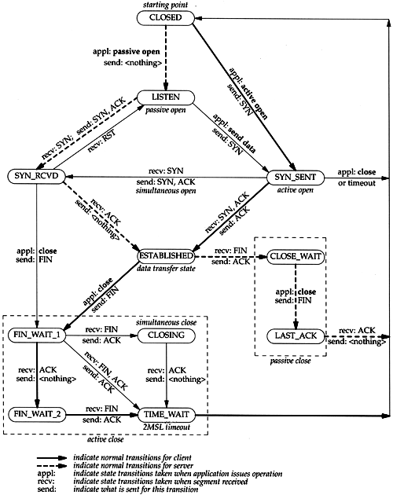

# MODULE 3 * Scanning Netwokrs

## CONCEPTS

### Types

* Port scanning
* Network scanning
* Vulnerability scanning

### Objectives

Discover:

* Live hosts, IP, open ports
* OS, Arquitecture
* Services
* Services: Applications or versions
* Vulnerabilities

### TCP flags

* SYN
* ACK
* PSH - Push
* URG
* FIN
* RST

### TCP/IP Comunication

## SCANNING TOOLS

[Tools](Tools.md)

## SCANNING TECHNIQUES

[Principal ports list](common-ports.pdf)

### ICMP

* ICMP Scanning
* Ping Sweep
* ICMP Echo scanning

### TCP

* Open TCP
  * TCP Connect / Full Open Scan
* Stealth TCP
  * Half-open Scan
  * Inverse TCP Flag
    * Xmas Scan
    * FIN Scan
    * NULL Scan
  * ACK Flag Probe
    * TTL-based ACK flag
    * WINDOW based ACK flag
    * 
* Third Party and Spoofed TCP
  * IDLE/IP ID Header Scanning

### UDP

* UDP Scanning

### SSDP y List scaning

## SCANING BEYOND IDS AND FIREWALL

Evasion techniques:

### Packet fragmentation

### Source Routing

### IP Adress Decoy

### IP Adress Spoofing
 IP Spoofing Detection:

 * Direct TTL probes
 * IP Identification number (IPID)
 * TCP Flow Control

 Countermeasures:

 * Avoid trust relationships
 * Use fw and filtering mechanisms
 * Use random seq. numbers
 * Ingress filtering
 * Egress filtering
 * Use encryption
 * SYN flooding countermeasures

### Proxy Server

Proxy chaining.

### Anonymizers.

Reasons:

* Ensuring privacy
* Accessing govermment-restricted content
* Protection against online attacks
* Bypassing IDS and FW rules

Types:

* Networked Anon.
* Single-Point Anon.

## BANNER GRABBING

## DRAW NETWORK DIAGRAMS

## SCANNING PEN TESTING

